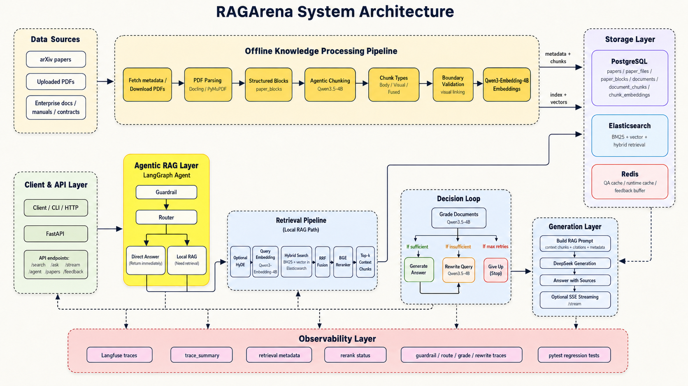
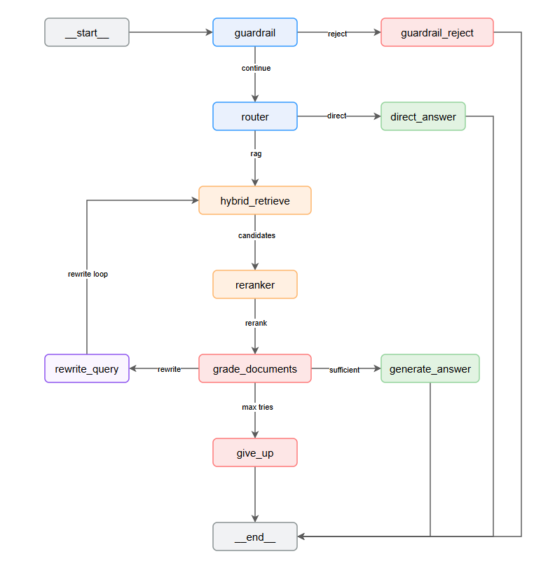
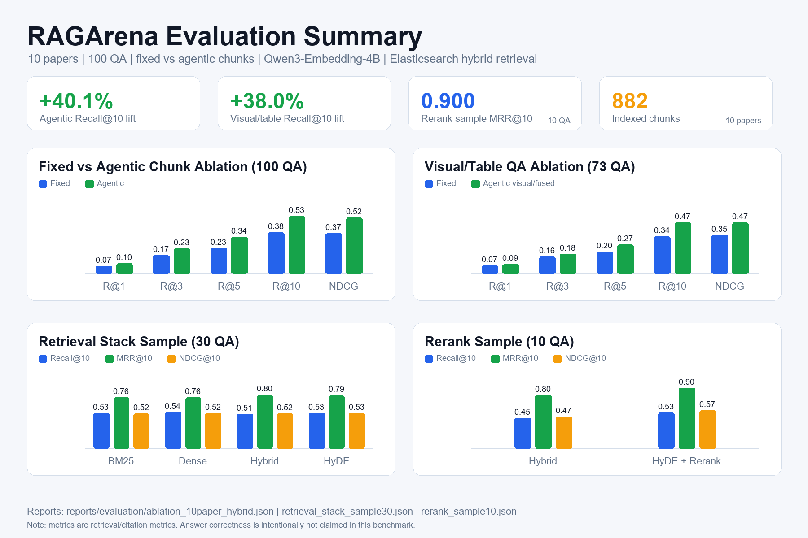

# RAGArena

> Agentic RAG for complex PDF question answering, with structured chunks, hybrid retrieval, LangGraph control flow, and reproducible retrieval evaluation.

[简体中文](README.zh-CN.md) | English


RAGArena is a local-first Agentic RAG system for long PDFs such as research papers, enterprise knowledge-base files, and technical manuals. It focuses on the failure modes of vanilla RAG in complex documents: unstable long-context recall, figure/table evidence, query rewriting, reranking, and citation-level source tracing.

## Highlights

- **Agentic chunking**: uses a local `qwen3.5:4b` model through Ollama to plan semantic boundaries over parsed document blocks.
- **Body / visual / fused chunks**: stores body text, table Markdown, figure captions, nearby text, and retrieval-only fused evidence as separate chunk types.
- **Hybrid retrieval**: Elasticsearch BM25 + Qwen3-Embedding-4B dense retrieval + optional HyDE + RRF fusion.
- **Reranking**: optional `BAAI/bge-reranker-v2-m3` reranker with candidate and content-length limits.
- **LangGraph workflow**: guardrail, routing, retrieval, rerank, document grading, query rewriting, answer generation, and give-up path.
- **Evaluation framework**: fixed-vs-agentic chunk ablation, visual/table subset evaluation, retrieval-stack comparison, rerank sampling, latency, Recall@k, MRR@10, and NDCG@10.

## Architecture

### System Architecture



RAGArena is split into an offline knowledge-processing path and an online Agentic RAG path.

Offline processing turns raw PDFs into searchable evidence:

```text
arXiv / uploaded PDFs / enterprise documents
 -> fetch metadata and download PDFs
 -> parse PDFs with Docling / PyMuPDF
 -> store structured paper_blocks
 -> plan agentic chunks with qwen3.5:4b
 -> build body / visual / fused chunks
 -> validate boundaries and link visual evidence
 -> embed chunks with Qwen3-Embedding-4B
 -> store metadata in PostgreSQL and search indexes in Elasticsearch
```

Online retrieval answers user queries through FastAPI and LangGraph:

```text
Client / CLI / HTTP
 -> FastAPI endpoints
 -> LangGraph guardrail and router
 -> direct answer OR local RAG
 -> optional HyDE
 -> Qwen3-Embedding-4B query embedding
 -> Elasticsearch BM25 + vector search
 -> RRF fusion
 -> BGE-Reranker
 -> top-k context chunks
 -> qwen3.5:4b document grading
 -> generate answer OR rewrite query OR give up
 -> answer with sources / optional SSE stream
```

PostgreSQL stores papers, files, parsed blocks, chunks, and embeddings. Elasticsearch serves BM25 and vector retrieval. Redis is used for QA/runtime cache and feedback buffering. Langfuse traces, trace summaries, retrieval metadata, rerank status, and pytest regression tests provide observability and evaluation support.

### Agent Workflow



The online path is:

```text
query
 -> guardrail
 -> router
 -> hybrid_retrieve
 -> rerank
 -> grade_documents
 -> generate_answer | rewrite_query | give_up
```

## Evaluation Results



The current benchmark is retrieval-focused. It measures whether the retrieved chunks hit the gold evidence chunks/pages and does **not** claim end-to-end answer correctness.

### Evaluation Corpus

| Item | Value |
| --- | ---: |
| Papers | 10 |
| Parsed paper blocks | 998 |
| Indexed chunks | 882 |
| QA cases | 100 |
| Figure/table QA cases | 73 |
| Embedding model | `Qwen3-Embedding-4B` |
| Decision/chunk model | `qwen3.5:4b` via Ollama |

Chunk distribution:

| Strategy / Type | Count |
| --- | ---: |
| `fixed:fixed` | 587 |
| `agentic:retrieval_unit` | 199 |
| `agentic:figure_caption` | 39 |
| `agentic:table` | 21 |
| `agentic_fusion:fused` | 36 |

### Fixed vs Agentic Chunk Ablation

Dataset: `data/eval/qa_ablation_100.json`  
Report: `reports/evaluation/ablation_10paper_hybrid.json`

| Variant | Cases | P50 ms | P95 ms | Recall@1 | Recall@3 | Recall@5 | Recall@10 | MRR@10 | NDCG@10 |
| --- | ---: | ---: | ---: | ---: | ---: | ---: | ---: | ---: | ---: |
| Fixed chunks + hybrid retrieval | 100 | 69.179 | 84.223 | 0.0683 | 0.1682 | 0.2337 | 0.3784 | 0.6154 | 0.3720 |
| Agentic chunks + hybrid retrieval | 100 | 58.715 | 79.781 | 0.0963 | 0.2327 | 0.3381 | 0.5301 | 0.7755 | 0.5181 |
| Relative lift | - | - | - | +41.0% | +38.4% | +44.7% | +40.1% | +26.0% | +39.3% |

### Visual/Table QA Ablation

This subset evaluates figure/table questions only.

| Variant | Cases | P50 ms | P95 ms | Recall@1 | Recall@3 | Recall@5 | Recall@10 | MRR@10 | NDCG@10 |
| --- | ---: | ---: | ---: | ---: | ---: | ---: | ---: | ---: | ---: |
| Fixed chunks + hybrid retrieval | 73 | 59.296 | 65.624 | 0.0730 | 0.1583 | 0.2045 | 0.3413 | 0.6432 | 0.3535 |
| Agentic visual/fused chunks + hybrid retrieval | 73 | 58.479 | 80.008 | 0.0886 | 0.1814 | 0.2686 | 0.4711 | 0.7697 | 0.4699 |
| Relative lift | - | - | - | +21.4% | +14.6% | +31.3% | +38.0% | +19.7% | +32.9% |

### Retrieval Stack Sample

Dataset: `data/eval/qa_ablation_sample30.json`  
Report: `reports/evaluation/retrieval_stack_sample30.json`

| Variant | Cases | P50 ms | P95 ms | Recall@10 | MRR@10 | NDCG@10 |
| --- | ---: | ---: | ---: | ---: | ---: | ---: |
| BM25 | 30 | 5.528 | 6.332 | 0.5256 | 0.7583 | 0.5170 |
| Dense | 30 | 47.132 | 87.914 | 0.5395 | 0.7585 | 0.5245 |
| Hybrid | 30 | 55.310 | 62.539 | 0.5145 | 0.8014 | 0.5223 |
| Hybrid + HyDE | 30 | 939.924 | 1277.299 | 0.5284 | 0.7900 | 0.5270 |

### Rerank Sample

Dataset: `data/eval/qa_ablation_rerank_sample10.json`  
Report: `reports/evaluation/rerank_sample10.json`

| Variant | Cases | P50 ms | P95 ms | Recall@10 | MRR@10 | NDCG@10 |
| --- | ---: | ---: | ---: | ---: | ---: | ---: |
| Hybrid | 10 | 59.122 | 7590.011 | 0.4548 | 0.7958 | 0.4740 |
| Hybrid + HyDE + Rerank | 10 | 27991.271 | 32062.291 | 0.5321 | 0.9000 | 0.5661 |

Reranking improves the small sample metrics but is still expensive on local hardware, so the full 100-QA rerank run is intentionally not used as the main headline number.

## Quick Start

### 1. Install dependencies

```powershell
uv sync
```

### 2. Start infrastructure

```powershell
docker compose up -d postgres elasticsearch redis
```

The current Docker compose file stores PostgreSQL data on an E-drive bind mount to avoid filling the system drive.

### 3. Prepare local models

Pull the local decision/chunking model:

```powershell
ollama pull qwen3.5:4b
```

Download Qwen3-Embedding-4B and point `.env` to the local path:

```powershell
uv run hf download Qwen/Qwen3-Embedding-4B --local-dir E:\models\Qwen3-Embedding-4B
```

```env
EMBEDDING_MODEL=E:\models\Qwen3-Embedding-4B
EMBEDDING_DIMENSIONS=2560
AGENT_DECISION_MODEL=qwen3.5:4b
AGENTIC_CHUNK_MODEL=qwen3.5:4b
RERANKER_MODEL=BAAI/bge-reranker-v2-m3
```

### 4. Run the API

```powershell
uv run uvicorn app.main:app --reload
```

Useful endpoints:

| Method | Path | Purpose |
| --- | --- | --- |
| `GET` | `/api/v1/health` | service health |
| `POST` | `/api/v1/search` | retrieval search |
| `POST` | `/api/v1/ask` | regular RAG answer |
| `POST` | `/api/v1/agent` | LangGraph agentic RAG |
| `POST` | `/api/v1/stream` | streaming answer |

## Reproduce the Evaluation

Reset data:

```powershell
uv run ragarena-reset-data --yes
```

Prepare the 10-paper ablation corpus, including fixed chunks, agentic chunks, fused chunks, embeddings, Elasticsearch indexing, and 100 QA cases:

```powershell
uv run ragarena-prepare-ablation-corpus `
  --papers-dir E:\ragarena-data\papers `
  --limit 10 `
  --qa-per-paper 10 `
  --output data/eval/qa_ablation_100.json `
  --plan-output data/eval/ablation_10paper_plan.json `
  --planner-provider ollama `
  --planner-model qwen3.5:4b
```

Run the main fixed-vs-agentic and visual/table ablation:

```powershell
uv run ragarena-eval benchmark `
  --dataset data/eval/qa_ablation_100.json `
  --plan data/eval/ablation_10paper_hybrid_plan.json `
  --output reports/evaluation/ablation_10paper_hybrid.json `
  --markdown reports/evaluation/ablation_10paper_hybrid.md
```

Run the retrieval-stack sample:

```powershell
uv run ragarena-eval benchmark `
  --dataset data/eval/qa_ablation_sample30.json `
  --plan data/eval/retrieval_stack_sample30_plan.json `
  --output reports/evaluation/retrieval_stack_sample30.json `
  --markdown reports/evaluation/retrieval_stack_sample30.md
```

Run the rerank sample:

```powershell
uv run ragarena-eval benchmark `
  --dataset data/eval/qa_ablation_rerank_sample10.json `
  --plan data/eval/rerank_sample10_plan.json `
  --output reports/evaluation/rerank_sample10.json `
  --markdown reports/evaluation/rerank_sample10.md
```

## Project Structure

```text
app/                         FastAPI application and API routes
src/ragarena/agent/           LangGraph workflow and agent policies
src/ragarena/chunking/        fixed, block, and agentic chunking
src/ragarena/cli/             ingestion, indexing, search, and evaluation CLIs
src/ragarena/evaluation/      benchmark framework and retrieval metrics
src/ragarena/embedding/       embedding encoder and repository
src/ragarena/papers/          arXiv download and PDF parsing
src/ragarena/retrieval/       Elasticsearch vector/BM25 search and RRF
src/ragarena/reranking/       BGE reranker wrapper
reports/evaluation/           benchmark outputs
docs/images/                  architecture and evaluation figures
tests/                        pytest test suite
```

## Tests

```powershell
uv run pytest
```

Targeted retrieval tests:

```powershell
uv run pytest tests/test_retrieval.py
```

## Notes

- The benchmark numbers are local experimental results on the current 10-paper corpus.
- `Answer Acc` is not used as a headline metric here because this evaluation run is designed for retrieval and citation evidence, not LLM answer judging.
- Rerank quality is promising but latency-heavy; current optimization limits candidate count and rerank input length.
- This repository currently does not include a license file.
